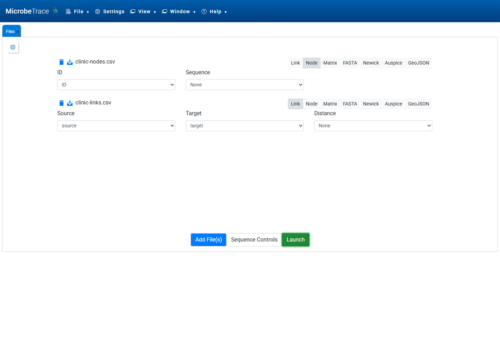
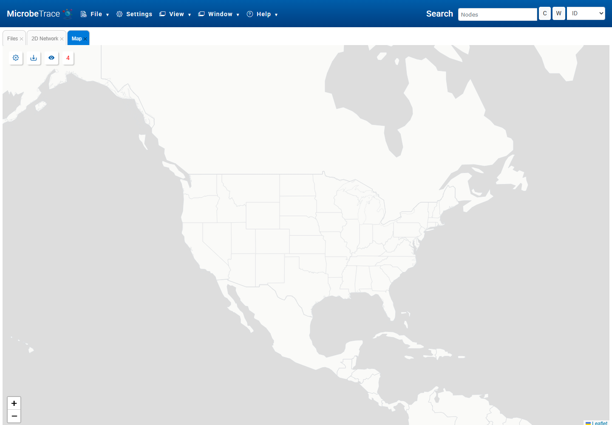
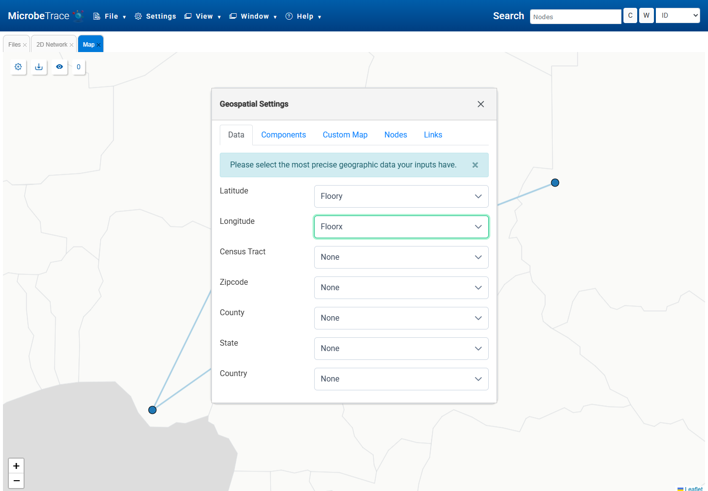
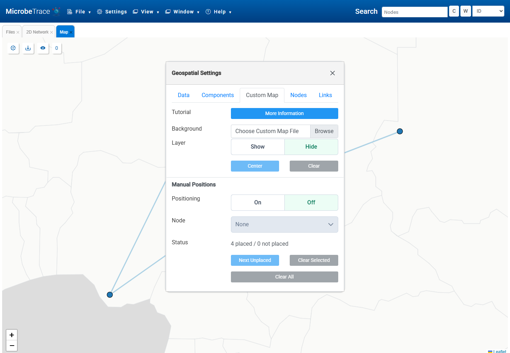
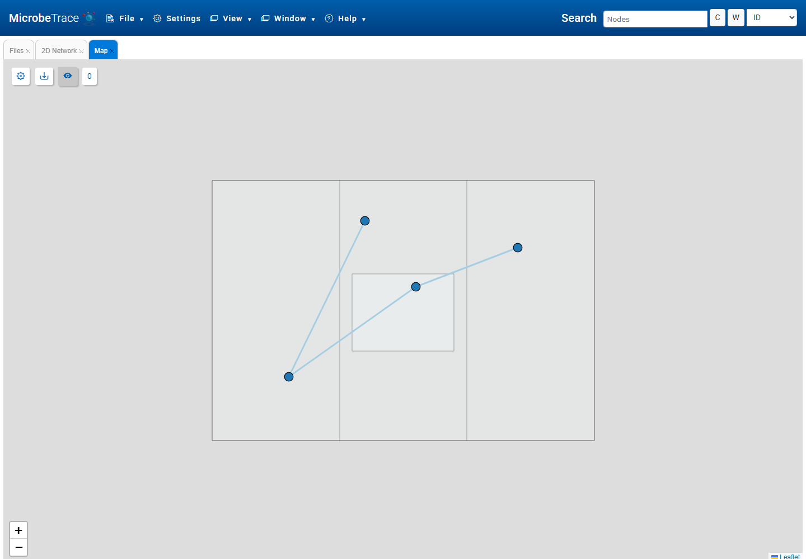
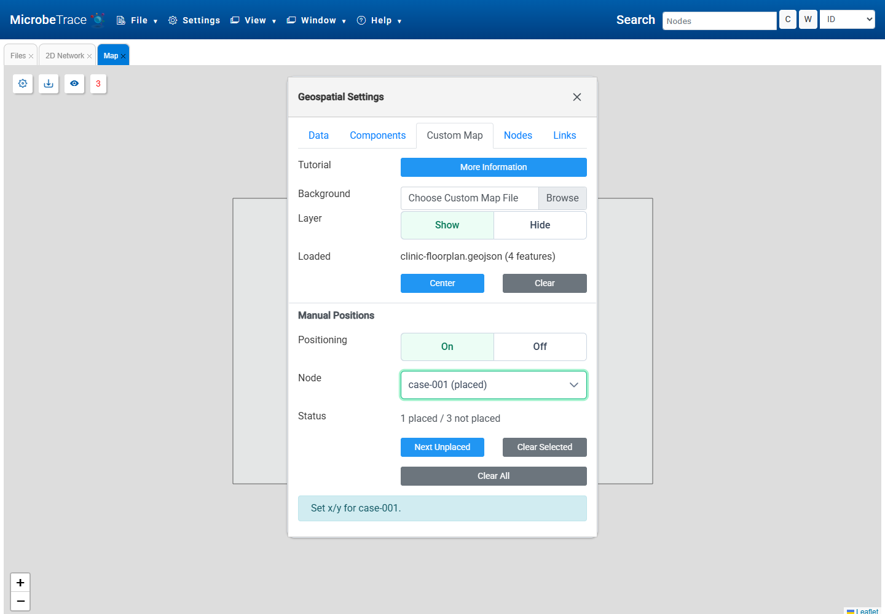

## **Custom Map tab**

Custom maps display the Map View network on a user-provided background, such as a floorplan, clinic layout, workplace, school, laboratory, or event venue. They are useful when geographic latitude and longitude are not the right coordinates for the investigation.

The Custom Map tab is found in the Map View settings dialog box. It supports image backgrounds, including PNG, JPG, GIF, WebP, BMP, and SVG files, and GeoJSON backgrounds. Only one custom background is active at a time.

For most custom maps, use:

* a node file with an ID column,
* a link file with source and target columns, and
* a custom map background file.

Nodes can be positioned from coordinate fields in the node file or placed manually after the background is loaded.

## **Data tab**

After the files are loaded, launch the session and open Map View.

Open the Geospatial Settings dialog box. If the node file includes custom map coordinates, select those fields in the Data tab. The selectors are labeled Latitude and Longitude, but for custom maps they can represent local coordinates instead of geographic coordinates.

Latitude controls vertical placement. Longitude controls horizontal placement. Both fields should contain numeric values.

## **Background**

In the Custom Map tab, use Background to choose the image or GeoJSON file to display behind the network. Set Layer to Show to display the background. Set Layer to Hide to return to the normal map without deleting the custom map settings.

Select Center to fit the custom background and visible network in the view. Center is useful after loading a background, changing coordinate fields, or manually positioning nodes.

When the background is shown, the normal Map View controls still apply. Nodes and links can be selected, styled, filtered, zoomed, and panned while the custom background is visible.

## **Floorplan coordinates**

For a floorplan or other local map, Longitude is the horizontal x value and Latitude is the vertical y value. GeoJSON backgrounds use GeoJSON coordinate order, so coordinate pairs are written as `[x, y]`.

Image backgrounds are normalized so the longer side of the image is 80 map units. A square image uses an x range of 0-80 and a y range of 0-80. A wide 1600 x 900 image uses an x range of 0-80 and a y range of 0-45.

If coordinates were measured from the top of an image, convert the y values before loading the file so that larger y values move upward on the custom map.

## **Manual Positions**

Manual Positions can be used when the node file does not include custom map coordinates, or when the existing coordinates need small adjustments. Turn Positioning On, select a visible node from the Node menu, and click the custom map to place it.

Only visible nodes are available in the Node menu. Filters, timeline settings, and other view settings can limit which nodes are listed.

Use Next Unplaced to move through visible nodes that have not yet been positioned. Existing markers can be dragged to new locations.

Manual positions are saved on each node as `map_floorplan_x` and `map_floorplan_y`. These fields are used while a custom background is shown. When the custom background is hidden, Map View returns to the geographic fields selected in the Data tab.

## **Save and reopen**

Custom backgrounds, background visibility, selected coordinate fields, and manual floorplan positions are saved in MicrobeTrace session files. Save the session after configuring a custom map to restore the same background and node positions later.

When a saved session is reopened, return to Map View and use Center in the Custom Map tab if the background or nodes open outside the current view.

## **Troubleshooting**

If the background loads but nodes are missing, confirm that Latitude and Longitude are set to numeric fields.

If nodes appear far from the background, check that the node coordinates use the same scale as the background. Image backgrounds use the normalized 0-80 coordinate range.

If an image floorplan appears but nodes are flipped vertically, the y values were probably measured from the top of the image.

If a GeoJSON background does not render, confirm that the file is valid JSON and uses one of these top-level types: FeatureCollection, Feature, GeometryCollection, Point, MultiPoint, LineString, MultiLineString, Polygon, or MultiPolygon.
